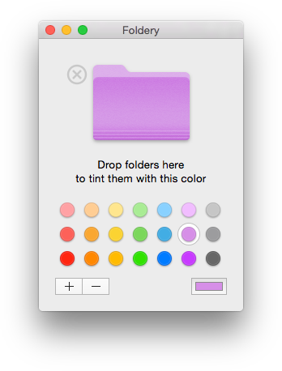

# Foldery
Copyright © 2014-2015 Betty Lab.  
Released under the terms of the [GNU General Public License v3](http://www.gnu.org/copyleft/gpl.html).

### What is Foldery?
It's a small utility for OS X that adds color to your folders!  

Why to use Finder's color tags only when you can have icons with different colors? Just select the color to apply and then drag your folders onto Foldery's window.  

That's all.

### Want to help?
Buy it on the [Mac App Store](https://itunes.apple.com/us/app/foldery/id815333099)!  
  
If you want to improve the program or add any feature, your code is welcome.

### History

* __v1.1__ _(2014-12-21)_
    * Improved color homogeneity across different display color profiles.
    * Better compatibility with Snow Leopard.

* __v1.0__ _(2014-11-12)_
    * Initial release.
